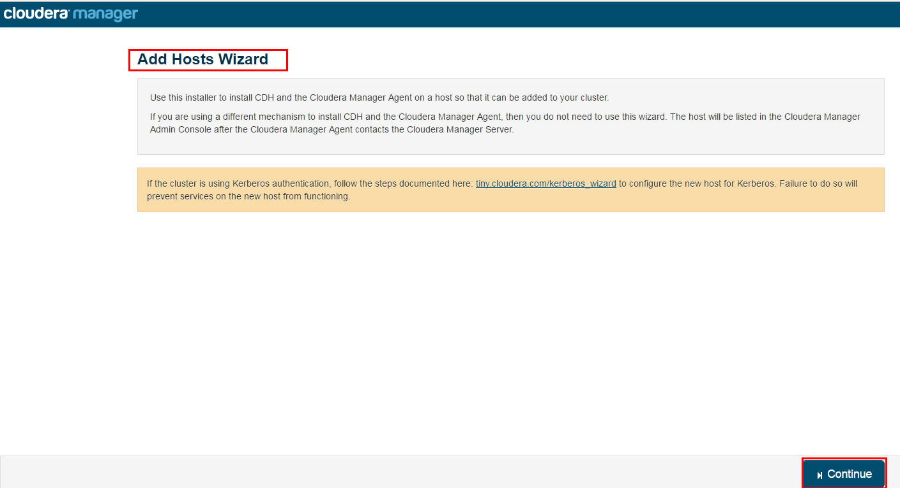
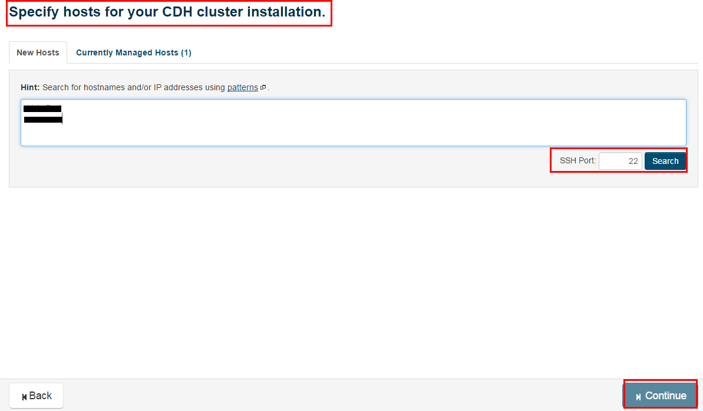
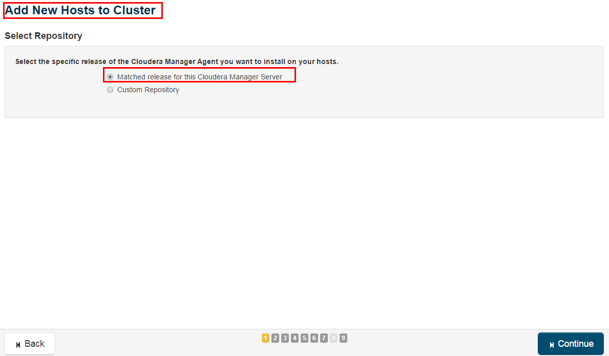
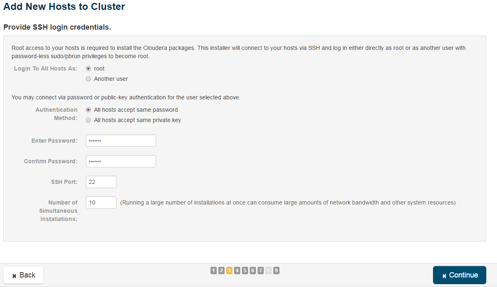

# 向新集群中添加数据节点（Cloudera Manager）
## 操作步骤：
### 一、修改 hostname
1. 修改新节点的 /etc/sysconfig/network 配置文件，按照集群节点命名规范更新HOSTNAME：

系统默认的：（将localhost按照需要的命名规则进行修改）

```

NETWORKING=yes

HOSTNAME=localhost.localdomain

```
2. 重启节点使HOSTNAME生效

```
[root@localhost ~]# reboot
Broadcast message from root@localhost.localdomain
        (/dev/pts/0) at 11:53 ...
The system is going down for reboot NOW!

```
3. 增加新节点的ip和hosename映射
/etc/hosts
增加新节点的ip和hostname映射，并用namenode的hosts文件覆盖新节点和已有节点，保持整个集群hosts文件同步
（__目前该操作暂时手工完成__）
```
127.0.0.1   localhost localhost.localdomain localhost4 localhost4.localdomain4
::1         localhost localhost.localdomain localhost6 localhost6.localdomain6
```

4. ssh免密码登录设置
#### 第一步：先在本地机器上使用ssh-keygen产生公钥私钥对

```
[root@hostname ~]# ssh-keygen
Generating public/private rsa key pair.
Enter file in which to save the key (/root/.ssh/id_rsa):
Created directory '/root/.ssh'.
Enter passphrase (empty for no passphrase):
Enter same passphrase again:
Your identification has been saved in /root/.ssh/id_rsa.
Your public key has been saved in /root/.ssh/id_rsa.pub.
The key fingerprint is:
6b:3e:fb:fb:78:3d:77:e7:32:9b:40:47:38:77:bd:ad root@hostname
The key's randomart image is:
+--[ RSA 2048]----+
|                 |
|             .  .|
|            o o o|
|             + .o|
|        S   . ...|
|         . . . . |
|        o   ..E  |
|       o.  ...=.+|
|        o+++. oB+|
+-----------------+

```

#### 第二步：将本机的公钥复制到远程机器的`authorized_keys`文件中，`ssh-copy-id`也能让你有到远程机器的`home, ~./ssh` , 和 `~/.ssh/authorized_keys`的权利
```
[root@d1-kafka1 .ssh]# ssh-copy-id -i ~/.ssh/id_rsa.pub root@d1-namenode1
The authenticity of host 'd1-namenode1 (172.21.150.11)' can't be established.
RSA key fingerprint is 23:1c:e4:23:5b:80:1c:af:bd:3d:c1:59:c5:c3:48:c5.
Are you sure you want to continue connecting (yes/no)? yes
Warning: Permanently added 'hostname,xxx.xxx.xxx.xxx' (RSA) to the list of known hosts.
root@hostname's password:
Now try logging into the machine, with "ssh 'root@d1-namenode1'", and check in:

  .ssh/authorized_keys

to make sure we haven't added extra keys that you weren't expecting.

```
### 二、安装jdk （也可以不适用手动安装，在CDH中自动安装）
当前集群使用的jdk版本为：`Oracle jdk-7u55-linux-x64`

部署位置为：

`/usr/local/jdk1.7.0_55`

`/usr/local/jdk`

其中`/usr/local/jdk` 为符号链（文件软链接），指向同级目录jdk1.7.0_55文件夹

1. 获取jdk tar包（可从其他节点拷贝）：
2. 
`# scp jdk-7u55-linux-x64.tar.gz root@新节点的IP:/usr/local/`

2. 将jdk tar包解压到 /usr/local/ 目录下：

`# cd /usr/local/`

`# tar -xzvf jdk-7u55-linux-x64.tar.gz`

3. 创建jdk符号链：
`# cd /usr/local/`

`# ln -s jdk1.7.0_55/ jdk`

4. 配置java环境变量 
在 `/etc/profile` 配置文件末尾添加：
```
export JAVA_HOME=/usr/local/jdk
export JRE_HOME=$JAVA_HOME/jre
export CLASSPATH=.:$JAVA_HOME/lib:$JRE_HOME/lib:$CLASSPATH
export PATH=$JAVA_HOME/bin:$JRE_HOME/bin:$PATH
```
Source该profile文件，使新配置的java环境变量生效：

`# source /etc/profile`

验证环境变量配置，并核对java版本：

`# java -version`

输出：
```
java version "1.7.0_55"
Java(TM) SE Runtime Environment (build 1.7.0_55-b13)
Java HotSpot(TM) 64-Bit Server VM (build 24.55-b03, mixed mode)
```

### 三、使用Cloudera Manager Web界面添加新节点
使用Cloudera Manager添加新节点需确保新节点能够访问互联网：
`# ping www.baidu.com`

但是出现：


`# ping baidu.com`

`ping: unknown host baidu.com`


> the host is unknow，可以断定是DNS的设置有问题。网上搜索也说这个错误的原因99%是/etc/resolv.conf中的DNS配置错误，或者没有这个配置
于是编辑 /etc/resolv.conf

>添加了两行（DNS地址是咨询了服务器运营商得知的）
> `nameserver 202.106.0.20`

> `nameserver 8.8.8.8`

> 再执行`service network restart`重启网络服务即可

```
[root@hostname ~]# service network restart
Shutting down interface bond0:                             [  OK  ]
Shutting down loopback interface:                          [  OK  ]
Bringing up loopback interface:                            [  OK  ]
Bringing up interface bond0:  Determining if ip address 172.xxx.xxx.xxx is already in use for device bond0...
                                                           [  OK  ]

```

新节点ssh服务需开启，默认监听端口22
(1) 登陆linux系统，打开终端命令。输入 rpm -qa |grep ssh 查找当前系统是否已经安装

```
[root@hostname ~]#  rpm -qa |grep ssh
libssh2-1.4.2-2.el6_7.1.x86_64
openssh-clients-5.3p1-117.el6.x86_64
openssh-5.3p1-117.el6.x86_64
openssh-server-5.3p1-117.el6.x86_64
```
(2) 如果没有安装SSH软件包，可以通过yum  或rpm安装包进行安装

`yum install ssh`

(3) 查看ssh是否正在运行：
```
[root@hostname ~]# service sshd status
openssh-daemon (pid  2766) is running...
```
浏览器访问以下地址进入Cloudera Manager界面：

`http://hostname:7180/cmf/home`
#### 1.点击进入“hosts”标签，点击“Add New Hosts to Cluster”按钮进入新增节点向导 




#### 2.填写待新增节点的IP地址，并且点击“Search”后CM提示检测到新节点，然后点击继续“Continue”



#### 3.选择安装与CM Server版本一致的agent：“Matched release for this Cloudera Manager Server”，并继续

#### 4.集群节点统一使用root用户。填写root用户密码，以便CM通过SSH完成剩余安装

#### 5.Cloudera Manager会自动完成新节点的安装并激活