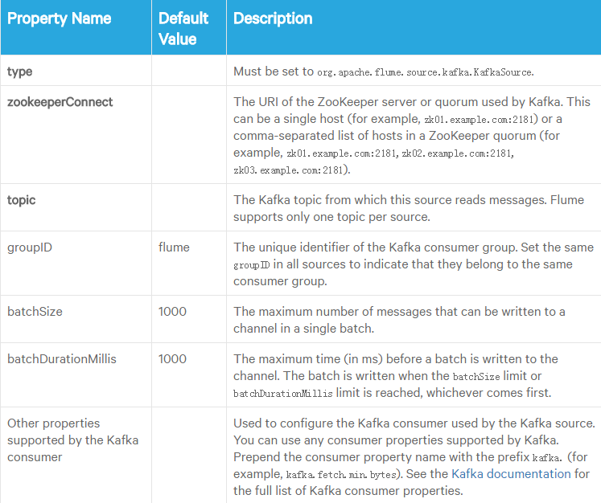
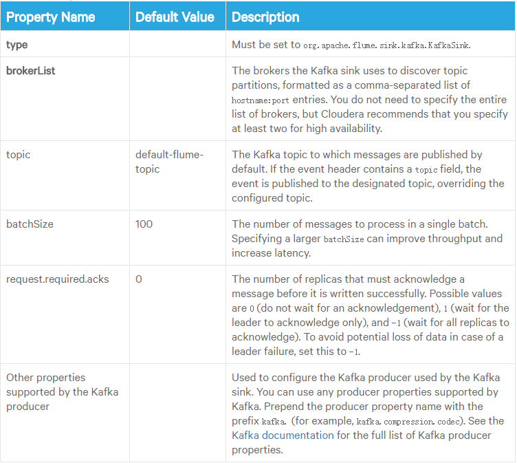

## Using Kafka with Flume
> In CDH 5.2 and higher, Flume contains a Kafka source and sink. Use these to stream data from Kafka to Hadoop or from any Flume source to Kafka.
In CDH 5.7 and higher, the Flume connector to Kafka only works with Kafka 2.0 and higher.
## kafka重要部分介绍，分为：source,sink,channel
### Kafka Source
> 使用kafka source 将kafka topic中的数据传输到hadoop中。kafka可以与任何flume sink结合使用，可以方便的将kafka中的数据写入到hdfs，hbase和solr

__示例__

```
tier1.sources  = source1
 tier1.channels = channel1
 tier1.sinks = sink1
 
 tier1.sources.source1.type = org.apache.flume.source.kafka.KafkaSource
 tier1.sources.source1.zookeeperConnect = zk01.example.com:2181
 tier1.sources.source1.topic = weblogs
 tier1.sources.source1.groupId = flume
 tier1.sources.source1.channels = channel1
 tier1.sources.source1.interceptors = i1
 tier1.sources.source1.interceptors.i1.type = timestamp
 tier1.sources.source1.kafka.consumer.timeout.ms = 100
 
 tier1.channels.channel1.type = memory
 tier1.channels.channel1.capacity = 10000
 tier1.channels.channel1.transactionCapacity = 1000
 
 tier1.sinks.sink1.type = hdfs
 tier1.sinks.sink1.hdfs.path = /tmp/kafka/%{topic}/%y-%m-%d
 tier1.sinks.sink1.hdfs.rollInterval = 5
 tier1.sinks.sink1.hdfs.rollSize = 0
 tier1.sinks.sink1.hdfs.rollCount = 0
 tier1.sinks.sink1.hdfs.fileType = DataStream
 tier1.sinks.sink1.channel = channel1
```
* 为了更高的吞吐量，配置多kafka sources从相同的topic读取，如果你配置所有的source使用相同的groupId,topic包含多分区。每个源从不同的分区集读取数据，从而提高摄取速度。
* 下表介绍了Kafka source支持的参数。 必需的属性以粗体显示。

* 调整注意：

1. auto.commit.enable is set to false by the source, and every batch is committed. For improved performance, set this to true using the kafka.auto.commit.enable setting. This can lead to data loss if the source goes down before committing.
2. consumer.timeout.ms is set to 10, so when Flume polls Kafka for new data, it waits no more than 10 ms for the data to be available. Setting this to a higher value can reduce CPU utilization due to less frequent polling, but introduces latency in writing batches to the channel.

### Kafka Sink
> Flume configuration example uses a Kafka sink with an exec source:
```
 tier1.sources  = source1
 tier1.channels = channel1
 tier1.sinks = sink1
 
 tier1.sources.source1.type = exec
 tier1.sources.source1.command = /usr/bin/vmstat 1
 tier1.sources.source1.channels = channel1
 
 tier1.channels.channel1.type = memory
 tier1.channels.channel1.capacity = 10000
 tier1.channels.channel1.transactionCapacity = 1000
 
 tier1.sinks.sink1.type = org.apache.flume.sink.kafka.KafkaSink
 tier1.sinks.sink1.topic = sink1
 tier1.sinks.sink1.brokerList = kafka01.example.com:9092,kafka02.example.com:9092
 tier1.sinks.sink1.channel = channel1
 tier1.sinks.sink1.batchSize = 20
```
* 下表介绍了Kafka sink支持的参数。 必需的属性以粗体显示。

* Kafka sink使用FlumeEvent头文件的topic和关键属性来确定在Kafka中发送事件的位置。 如果标题包含topic属性，则将该事件发送到指定的topic，覆盖已配置的topic。 如果标题包含密钥属性，则该密钥用于对主题中的事件进行分区。 具有相同密钥的事件将发送到同一个分区。 如果未指定密钥参数，事件将随机分布到分区。 使用这些属性来控制通过Flum source或intercepter(拦截器)发送事件的topics和partitions。