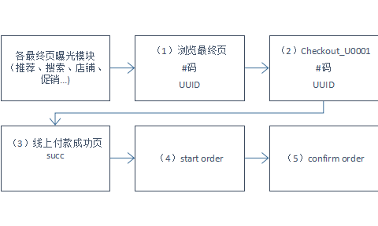

### 最终页模块逻辑

#### 一、 一般曝光模块
路径：
（1）-（4）-（5）

* 语言&站点：
要求最终页的语言和站点与下单时的语言和站点一样

* 时间性：
  * 要求在最终页的当天完成下单；
  * 下单时间在最终页时间之后；
  * 订单在下单的当天或者第二天完成confirm；

* 其它通用限制条件：
vid不为空

* 关联条件：
vid 或者 buyerid    item_code

#### 二、特殊曝光模块说明（搜索+推荐）

* 搜索（click_position rlike '^s[0-9]+'）
* 路径：
（1）-（4）-（5）
搜索www需要有一个特殊处理，就是列表页加入购物车情况
（2）-（4）-（5）

* 语言&站点&时间性：
同上

* 其它通用限制条件：
同上+UUID不为空

* 关联条件：
同上+UUID

* 推荐
路径：
后端曝光-（1）-（4）-（5）
后端曝光见下面说明d)；历史推荐不能限制UUID和后端曝光，只能通过#tracking来限定（1）-（4）-（5）
其余限制同搜索

#### 三、一些表和数据说明
* a)最终页#tracking的第一段在click_position字段，具体参考下面的整理

* b)下单时的vid选用ods_rfx_prod_ext.vid字段
   * 说明：线上付款成功页succ记录的订单vid与ods_rfx_prod_ext.vid的匹配度达到95%；所以放弃付款成功页这个限制条件（线下付款不会走这个页面，以及付款成功页经常也出现加载问题）
* c)放弃了上次讨论时的Checkout_U0001事件的限制
   * 说明：经过与搜索和推荐的同事讨论，业务认为一个模块的曝光，目的是有效曝光让用户当天完成购买，但很难让用户在这个模块完成加购物车的动作；不建议lastclick的归因方法，建议给购物车之前的每个路径都归因；
   * 数据：有27%的下单用户，会在购买这个产品之前按从2个及以上不同的位置查看最终页，这部分GMV会归因到多个位置
* d)推荐的后端事件表为ods_log_rec_s，这个表2016.4月才开始添加；所以推荐的历史数据没有UUID
* e)当天完成下单
      * www上，当天下单的订单中，有81%在当天有对应的最终页事件
      * wap上，当天下单的订单中，有91%在当天有对应的最终页事件
      * www对比wap值低的一部分原因是列表页直接加购物车
* f)当天或者第二天完成confirm
      * 订单在下单当天完成confim的占92%；
      * 当天或者第二天完成confirm的占96%