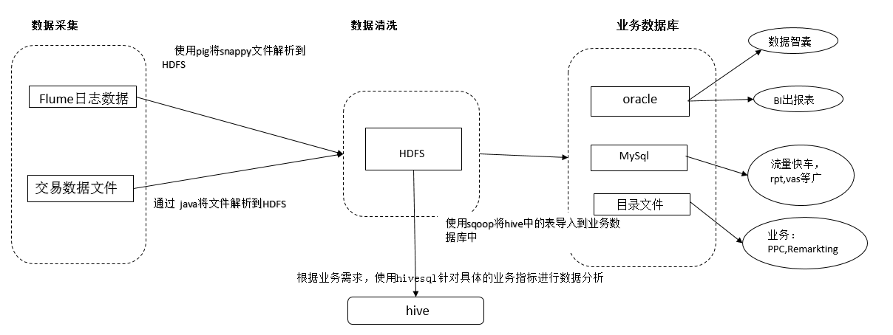
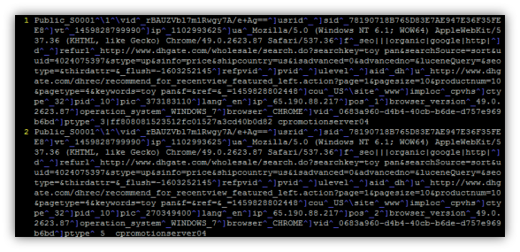

## 数据仓库架构

## 日志采集架构
Flume日志采集：

由各业务的后台服务器产生，如点击浏览事件、用户搜索、添加购物车、添加收藏夹、曝光事件。以及移动、多语言、DHport等日志数据（这些程序嵌入了D1的日志收集模块）

* 以文件形式存放在各业务系统server上（/usr/local/serverlog/serverlog）
* 使用Flume来实时采集这些分布在各个业务服务器上的文件
* 写入到HDFS
* 事件直观上就是我们收集的日志文件中的一条记录
* 这条记录有很多字段组成
* 需要一个统一的规则，来规范如何存储这些字段的值

### 交易数据
由DBA每天将生成的订单、商品以及买卖家的增量数据发送到D1的服务器端，然后由java编写的parse_inclog程序进行解析到本地，再转入到HDFS中

### 仓库分层
* Operational Data Store (ODS)
* Middle Tier Data Store (MDS？)
* Summarized Data Store (SDS)
* Reports (RPT)

### ETL job
* Hive SQL + Bash Script & pig + Bash Script
* 业务逻辑由SQL（或者pig）实现
* Bash Script：
   * 计算变量（如 $ETL_DATE)
   * 调用hive执行SQL
   * 处理数据文件
   * 文件校验监控
   * ……
* bigdata\SVN_DOC\数据仓库编程规范V0.1.doc

### Scheduler
* 使用pentaho kettle
* 用kettle来维护ETL job的依赖关系
* kettle生成KJB文件
* 使用操作系统自带定时任务Crontab/rundeck来调用KJB文件

#### Rundeck调度：

### 数据应用：
* 数据智囊。
* Report日常报表等
* 流量快车、rpt、vas、ppc等广告
